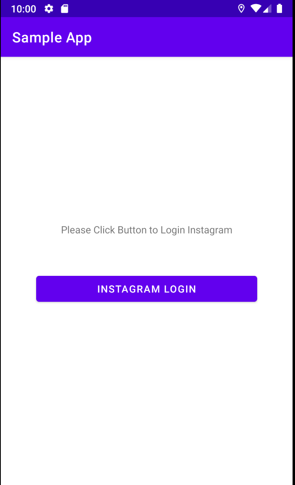
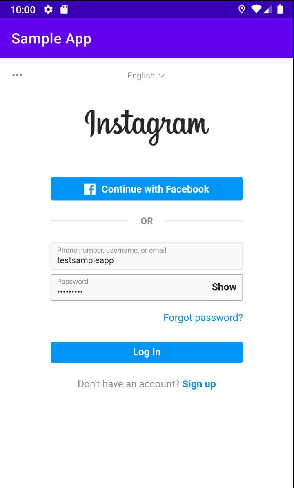
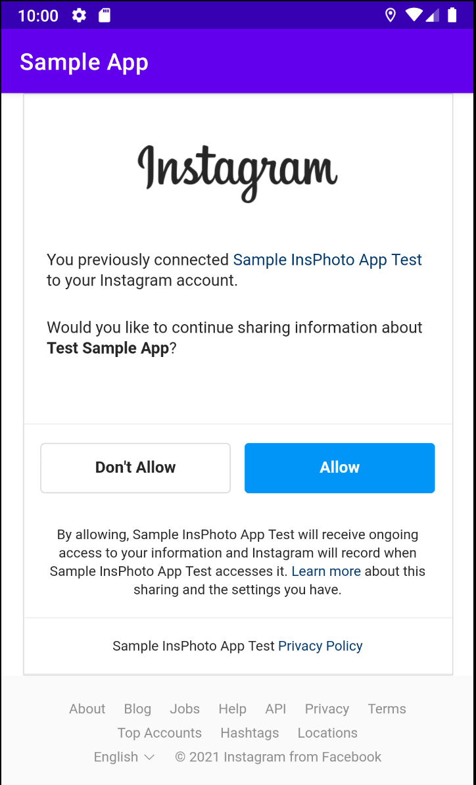
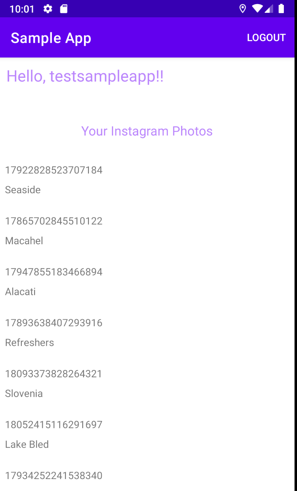
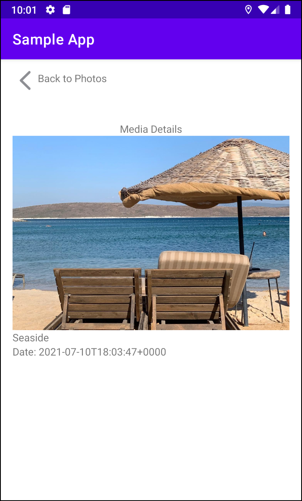

# Project Title

Sample App

## Getting Started

This sample app uses Instagram's basic display api. https://developers.facebook.com/docs/instagram-basic-display-api/overview
An Instagram user can login and in master screen her/his media list will be displayed.
When the item in the list is clicked, user will be navigated to detail screen where media detail can be viewed.
Important Note: Since this app is still in development mode, only registered testers can login through this app and client_id given in AppUtil class.
"TestSampleApp" username is the only registered tester right now. In order to obtain password, contact me at zmervekaraman@gmail.com
Or you can create your own app and client_id https://developers.facebook.com/apps to test the functionality.

### Screenshots

